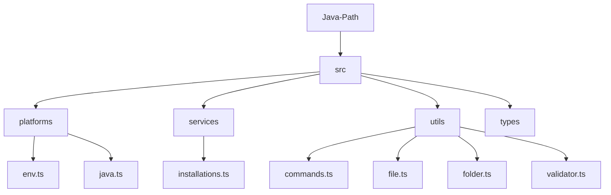

# Project Structure

The project follows a modular structure to separate concerns between platform detection, services, and core utilities.

## Directory Breakdown

- **`src/platforms/`**: Contains code specific to platform detection (`env.ts`) and platform-specific Java logic (`java.ts`).
- **`src/services/`**: Higher-level services, such as scanning for and validating Java installations (`installations.ts`).
- **`src/utils/`**: General-purpose utilities.
  - `commands.ts`: Executing shell commands, checking for installed packages/commands.
  - `file.ts`: File system operations (read/write/delete/verify).
  - `folder.ts`: Directory scanning and statistics.
  - `validator.ts`: Standardized response objects (`ServiceResponse`) and type guards.
- **`tests/`**: Mirroring the `src` structure, containing unit and integration tests.
- **`examples/`**: Runnable scripts demonstrating how to use the library.
